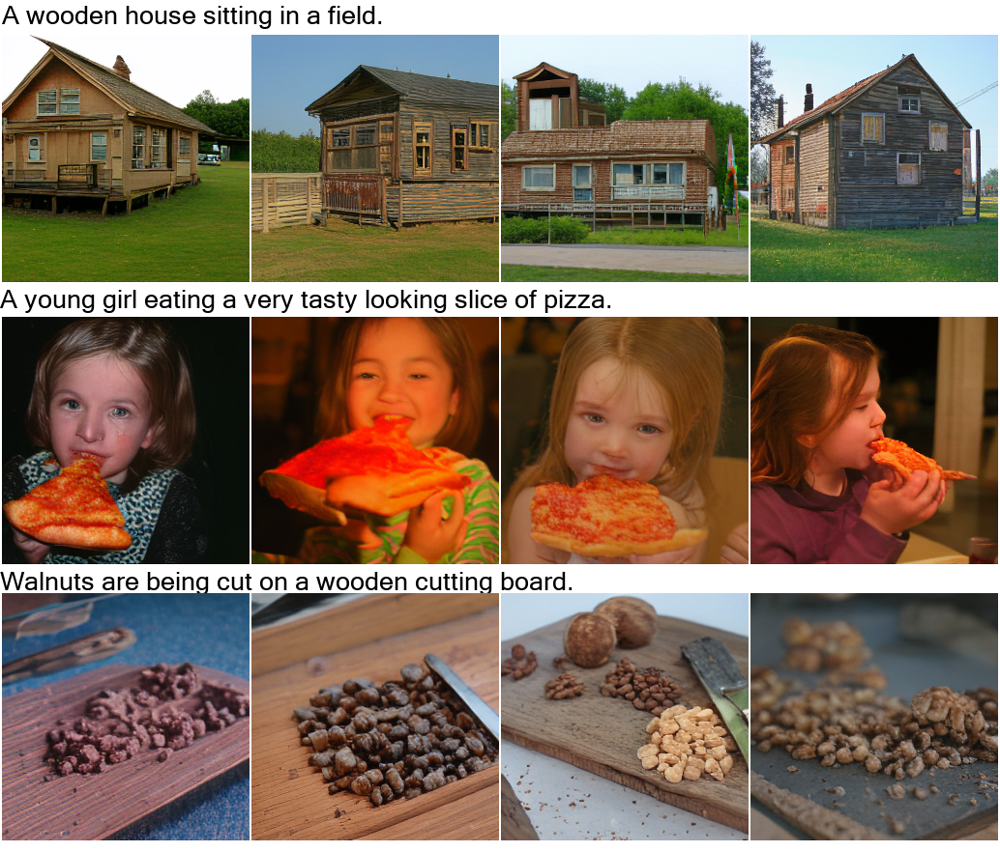
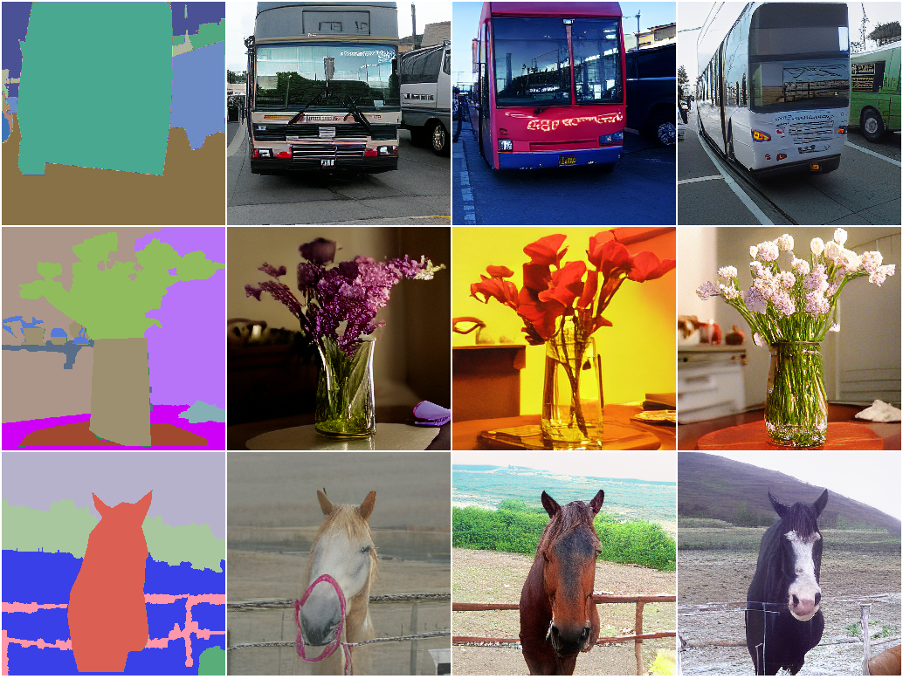

<h1 align = "center">NUWA</h1>

> NÜWA is a unified multimodal pre-trained model that can generate new or manipulate existing
 visual data (i.e., images and videos) for 8 visual synthesis tasks (as shown above).
## Text-To-Image (T2I)

## SKetch-to-Image (S2I)

## Image Completion (I2I)

## Text-Guided Image Manipulation (TI2I)

## Text-to-Video(T2V)

## Video Prediction (V2V)

## Sketch-to-Video (S2V)

## Text-Guided Video Manipulation (TV2V)

