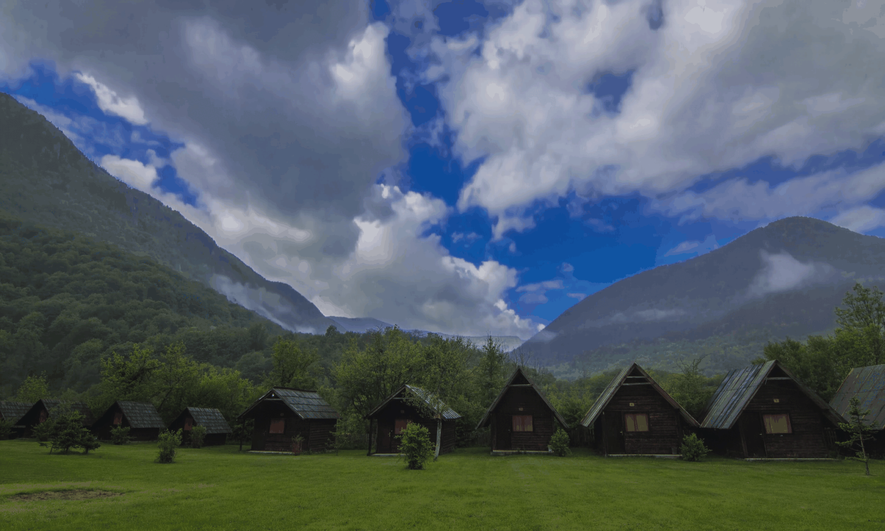
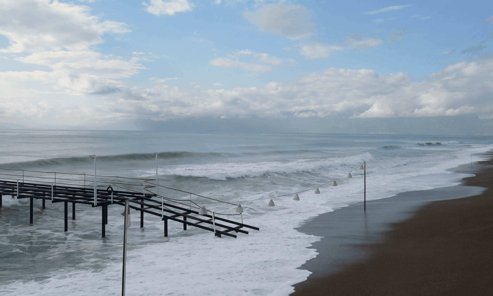
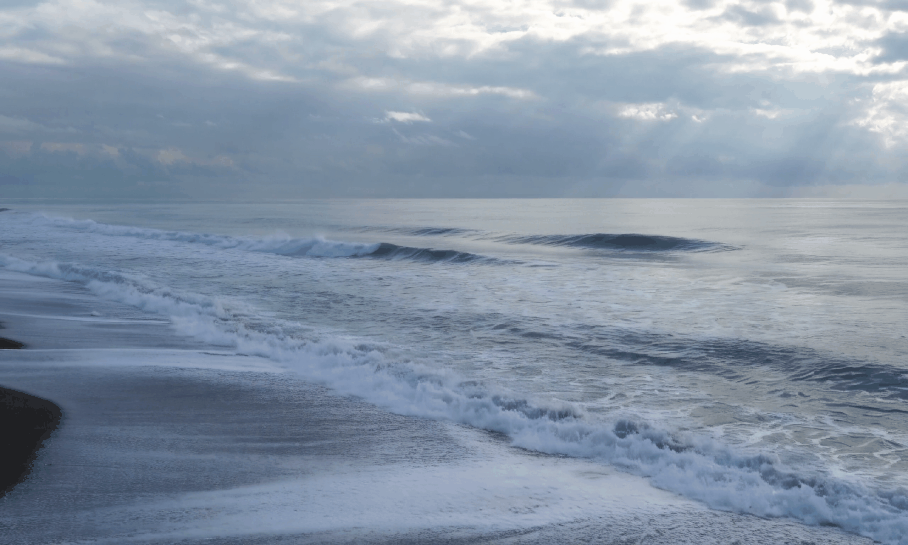

<h1 align = "center">NUWA-Infinity</h1>

> NUWA-Infinity is a generative model for infinite visual synthesis, which is defined as the task of generating arbitrarily-sized high-resolution images or long-duration videos.

[\[Project page\]](https://nuwa-infinity.microsoft.com/#/) [\[Paper\]](https://arxiv.org/abs/2207.09814)

##  Image Outpainting $^{HD}$
#### Given a certain image, NUWA can extend it into any size and resolution by learning , imagining, and generating new contents.

##  Image Animation $^{HD}$
#### To bring life to static pictures, NUWA can transform images into videos and display eye-catching vividness.   

 

 

## Text-To-Image $^{HD}$
#### With simple words and sentences, NUWA can generate varies of breath-taking images with impressively-high resolution. 

