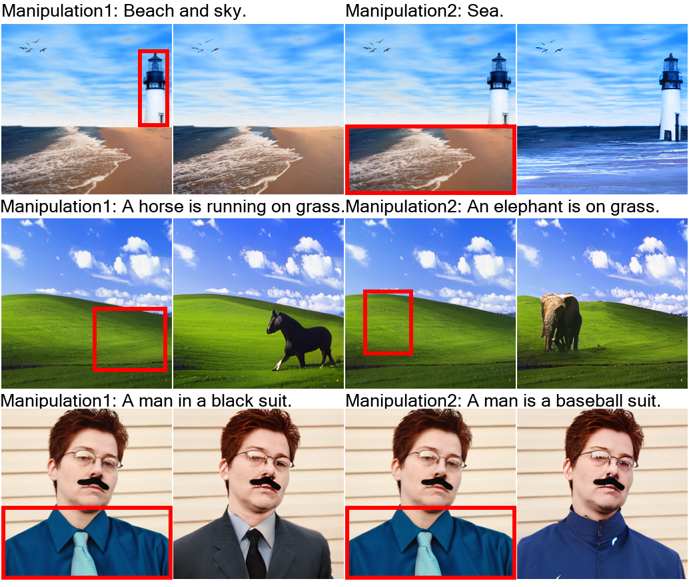
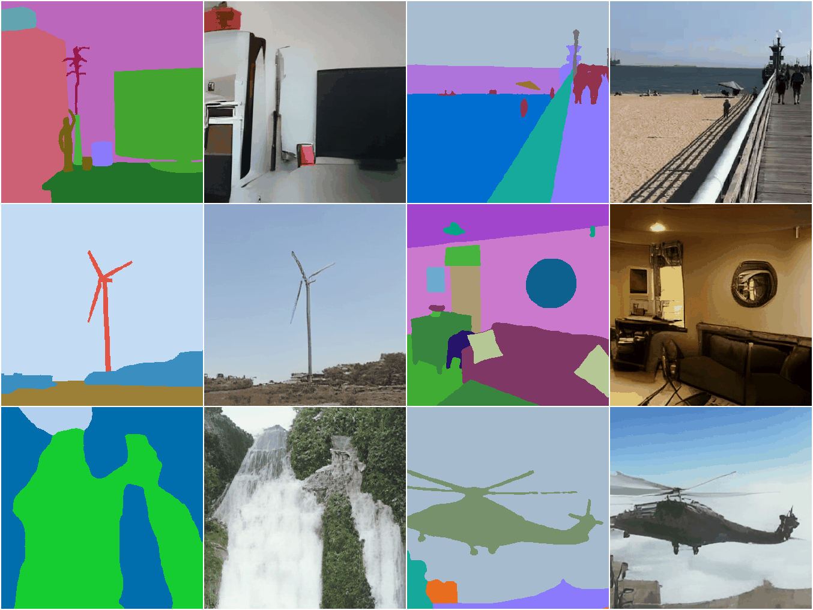
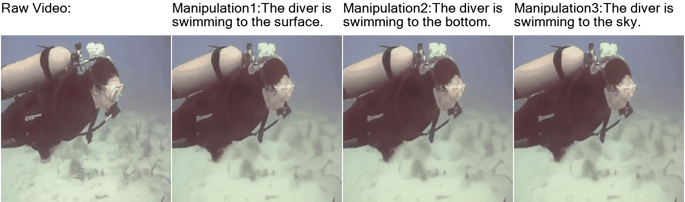

# Overview

> This is the official repo for the paper: [NÜWA: Visual Synthesis Pre-training for Neural visUal World creAtion](https://arxiv.org/abs/2111.12417).

NÜWA is a unified multimodal pre-trained model that can **generate new** or **manipulate existing** visual data (i.e., **images and videos**) for **8** visual synthesis tasks (as shown above).

# Samples
## Text-To-Image (T2I)

## SKetch-to-Image (S2I)

## Image Completion (I2I)

## Text-Guided Image Manipulation (TI2I)

## Text-to-Video(T2V)

## Video Prediction (V2V)

## Sketch-to-Video (S2V)

## Text-Guided Video Manipulation (TV2V)

