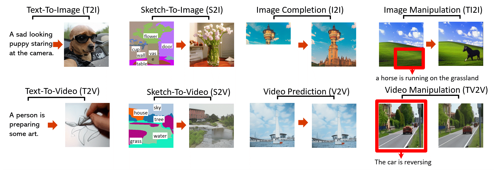

This is the official repo for the following papers: 
 
+ [NÜWA: Visual Synthesis Pre-training for Neural visUal World creAtion](https://arxiv.org/abs/2111.12417). (ECCV 2022)

+ [NUWA-Infinity: Autoregressive over Autoregressive Generation for Infinite Visual Synthesis](https://arxiv.org/abs/2207.09814). (NeurIPS 2022)

+ [NUWA-LIP: Language Guided Image Inpainting with Defect-free VQGAN](https://arxiv.org/abs/2202.05009). (CVPR 2023)

+ [Learning 3D Photography Videos via Self-supervised Diffusion on Single Images](https://arxiv.org/abs/2302.10781). (IJCAI 2023)

+ [NUWA-XL: Diffusion over Diffusion for eXtremely Long Video Generation](https://arxiv.org/abs/2303.12346). (ACL 2023)

## Update 2022/7/13: [NUWA-Infinity](NUWAInfinity.md)
[\[Project page\]](https://nuwa-infinity.microsoft.com/#/) [\[Paper\]](https://arxiv.org/abs/2207.09814) 

[NUWA-Infinity](NUWAInfinity.md) is a generative model for infinite visual synthesis, which is defined as the task of generating arbitrarily-sized high-resolution images or long-duration videos.

 

## Update 2021/11/26: [NÜWA](/NUWA.md)
[NÜWA](/NUWA.md) is a unified multimodal pre-trained model that can **generate new** or **manipulate existing** visual data (i.e., **images and videos**) for **8** visual synthesis tasks (as shown above).

